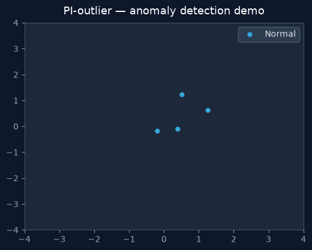

# PI-outlier

*Anomaly detection framework for tabular, time-series, and vision data*

[](https://github.com/askmy-stack/anomaly-detection/actions/workflows/ci.yml)
[](LICENSE)
[](https://www.python.org/downloads/)



**PI-outlier** is a modular anomaly-detection framework evolved from UCF crime-classification notebooks into a community-ready Python package. It ships with CLI tools, a REST API, streaming detectors, root-cause analysis, fairness metrics, and optional LLM explanations.

> **Package name:** The installable Python package remains `anomaly_detection` (`pip install anomaly-detection`). PI-outlier is the project brand; imports use `import anomaly_detection`.

Repository: [github.com/askmy-stack/anomaly-detection](https://github.com/askmy-stack/anomaly-detection)

## Features

| Area | Capabilities |
| --- | --- |
| **Detectors** | z-score, IQR, Isolation Forest, LOF, One-Class SVM, autoencoder, diffusion reconstruction |
| **CLI** | `detect`, `benchmark`, `stream` |
| **REST API** | Tabular detection, batch CSV upload, RCA, LLM explain, optional vision classification |
| **Data** | Registry-driven loaders (OpenML, CSV, UCF fixtures) |
| **Streaming** | Online z-score window; optional PySAD wrappers |
| **RCA** | Causal graph scoring with ranked root causes |
| **Vision** | UCF 14-class image/video classification (supervised, separate from `/detect`) |
| **Fairness** | Demographic parity, equalized odds, reweighing mitigation (AIF360) |
| **LLM** | Opt-in anomaly explanations with PII redaction |
| **Multimodal** | Experimental tabular+text fusion |

See [docs/EXECUTION_PLAN.md](docs/EXECUTION_PLAN.md) for the phased roadmap and [CHANGELOG.md](CHANGELOG.md) for release history.

## Open Source Contributions

We welcome contributions! Here's how to get involved:

| Area | Good first issues | Skills needed |
| --- | --- | --- |
| **Detectors** | New algorithms, sklearn wrappers, diffusion tuning | Python, ML |
| **Data loaders** | Dataset registry entries, OpenML/CSV adapters | Python, pandas |
| **API & CLI** | FastAPI endpoints, `detect`/`benchmark`/`stream` flags | Python, FastAPI |
| **Vision** | UCF module, Grad-CAM, TensorFlow model paths | Python, CV |
| **Streaming** | PySAD wrappers, online z-score window | Python, time-series |
| **RCA** | Causal graph scoring, metric ranking | Python, statistics |
| **Fairness & ethics** | AIF360 integration, bias mitigation | ML fairness |
| **LLM** | Explainer prompts, PII redaction rules | Python, LLM APIs |
| **Docs & tutorials** | `docs/tutorials/`, API examples | Markdown |
| **Evaluation** | Benchmark harness, profiler, metrics | Python, pytest |

See [CONTRIBUTING.md](CONTRIBUTING.md) and [docs/EXECUTION_PLAN.md](docs/EXECUTION_PLAN.md).

## Project layout

```
src/anomaly_detection/   # installable package (import path unchanged)
  models/                # tabular & deep detectors
  api/                   # FastAPI routes
  cli/                   # detect, benchmark, stream
  data_ingestion/        # registry + loaders
  domains/vision/        # UCF classification (optional [vision] extra)
  streaming/             # online detectors
  rca/                   # root cause analysis
  fairness/              # bias metrics & mitigation
  llm/                   # anomaly explainer
  multimodal/            # fusion (experimental)
configs/                 # YAML configuration
datasets/registry.yaml   # dataset metadata & licenses
tests/                   # pytest suite (73 tests)
docs/tutorials/          # step-by-step domain guides
examples/notebooks/      # original vision notebooks
examples/legacy-frontend/  # deprecated static site
```

## Setup

Requires Python 3.11+.

```bash
git clone https://github.com/askmy-stack/anomaly-detection.git
cd anomaly-detection
python -m venv .venv
source .venv/bin/activate   # Windows: .venv\Scripts\activate
pip install -e ".[dev]"
```

### Optional extras

```bash
pip install -e ".[dev,streaming]"   # PySAD streaming detectors
pip install -e ".[dev,rca]"         # root cause analysis
pip install -e ".[dev,vision]"      # TensorFlow + OpenCV for UCF endpoints
pip install -e ".[dev,fairness]"    # AIF360 fairness metrics
pip install -e ".[dev,generative]"  # diffusion detector
pip install -e ".[dev,llm]"         # Anthropic LLM explainer
```

Verify the install:

```bash
ruff check src tests
pytest tests/ -v --cov=anomaly_detection
detect --config configs/default.yaml
benchmark --quick
serve    # REST API on http://localhost:8000
```

## CLI

| Command | Description |
| --- | --- |
| `detect --config CONFIG` | Run detection; writes JSON report and optional plot |
| `benchmark --quick` | Benchmark all registry datasets × detectors on fixtures |
| `benchmark --quick --profile` | Same, with wall-time and peak-memory profiling |
| `stream --config CONFIG` | Online streaming detection |

Example:

```bash
python -m anomaly_detection.cli.detect --config configs/default.yaml
python -m anomaly_detection.cli.benchmark --quick --profile
```

## REST API

Start the server with `serve` (or `uvicorn anomaly_detection.api.app:app`). Interactive docs at `/docs`.

| Endpoint | Method | Description |
| --- | --- | --- |
| `/health` | GET | Liveness check |
| `/detect` | POST | Detect anomalies from a 2D numeric array + optional config override |
| `/detect/batch` | POST | Upload a CSV file for batch detection |
| `/models` | GET | List registered detector names |
| `/root_cause` | POST | Rank root causes for an anomaly given multivariate metrics |
| `/root_cause/{anomaly_id}` | GET | Retrieve a cached RCA result |
| `/explain` | POST | Generate plain-language anomaly explanation (LLM opt-in) |
| `/vision/analyze/image` | POST | Classify an image into 14 UCF crime categories (`[vision]` extra) |
| `/vision/analyze/video` | POST | Classify a video via frame sampling (`[vision]` extra) |

**Note:** Vision endpoints perform **supervised multi-class classification**, not unsupervised anomaly detection. They are intentionally separate from `/detect`.

## Benchmark results (quick mode, fixtures)

Run `benchmark --quick` locally to reproduce. Representative results on test fixtures:

| Dataset | Detector | Precision | Recall | F1 | ROC-AUC |
| --- | --- | ---: | ---: | ---: | ---: |
| credit_card_fraud | isolation_forest | 1.0000 | 1.0000 | 1.0000 | 1.0000 |
| nab | isolation_forest | 1.0000 | 1.0000 | 1.0000 | 1.0000 |
| ucf_crime | lof | 1.0000 | 1.0000 | 1.0000 | 1.0000 |

Profiling (isolation_forest on credit_card_fraud fixture): ~0.12 s wall time, ~194 MB peak memory on Apple Silicon (Python 3.13).

## Datasets

Registered in [datasets/registry.yaml](datasets/registry.yaml):

| ID | Domain | License |
| --- | --- | --- |
| `credit_card_fraud` | tabular | CC-BY-4.0 |
| `nab` | timeseries | AGPL-3.0 |
| `ucf_crime` | vision | Custom (academic use) |

## Tutorials

| Tutorial | Topic |
| --- | --- |
| [01-tabular-fraud](docs/tutorials/01-tabular-fraud.md) | Credit-card fraud (`configs/examples/fraud.yaml`) |
| [02-timeseries-iot](docs/tutorials/02-timeseries-iot.md) | NAB time-series and IoT streaming |
| [03-vision-surveillance](docs/tutorials/03-vision-surveillance.md) | UCF vision classification (supervised) |
| [04-streaming](docs/tutorials/04-streaming.md) | Online `stream` CLI |
| [05-fairness](docs/tutorials/05-fairness.md) | Fairness metrics and mitigation |

## Vision domain (legacy notebooks)

Pre-trained SavedModel artifacts remain at the repository root:

- `Image Anomaly Detection-2/` — image classifier
- `Video Anomaly Detection/` — video classifier

Configure paths in `configs/examples/vision.yaml`. To explore the original notebooks:

```bash
jupyter notebook examples/notebooks/
```

## Contributing

See [CONTRIBUTING.md](CONTRIBUTING.md). Please read [docs/EXECUTION_PLAN.md](docs/EXECUTION_PLAN.md) before starting substantial work.

## License

MIT — see [LICENSE](LICENSE).

---

Built by [Abhinaysai Kamineni](https://github.com/askmy-stack)
